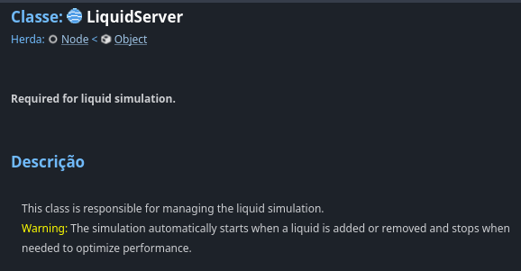
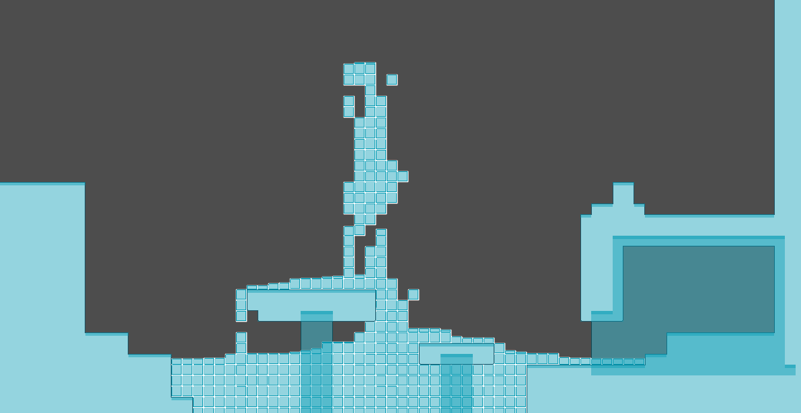
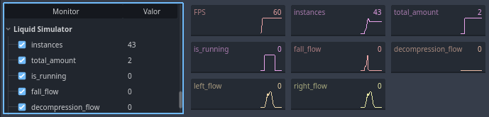

# 2D Liquid Simulator (In Godot Engine)

Originally created by [Tterrasson](https://github.com/tterrasson) ([repository](https://github.com/tterrasson/liquid-simulator-godot)) and recreated by [me](https://github.com/L-Marcel), this plugin offers a set of three 2D nodes to simulate the behavior of liquids.

## Warning
Although I have a version of this plugin for Godot 4.2, the next updates I release will often be for the newer version of Godot (4.3+), as it is tiring to change the code twice or more.

## Tutorial
I recorded [this video](https://youtu.be/BEGQCnjjcbY) showing the simulator in operation and teaching how to use it. But I apologize, because in it I am limited to my mother tongue, Portuguese.

## Documentation

The entire code API is documented and can be viewed in the Godot docs tab. If you have any difficulty with this, I recommend this [video](https://www.youtube.com/watch?v=B7G6sVNDczY&t).

## Who its work?
The LiquidServer stores the position of each instance of a `Liquid` and manages the flow of the quantity of each `Liquid` when necessary or requested by the API. When the flow stops permanently, LiquidServer stops running to increase performance.

It also decides when to update the `Liquid` sprite and checks when a cell is available or not.

## Is it possible to detect collisions with a Liquid?
Yes, it is possible, but it comes at a performance cost, of course. Each `Liquid` cell is actually an instance of a packaged scene, so it can contain an Area2D, for example. But it is not recommended to transform a `Liquid` into some type of PhysicBody (this costs a lot of performance).

But a tip for this situation: if you are going to use Area2D, mark monitorable with false, leave it as a child of the `Liquid` sprite and make it a little smaller than it.

## Performance Guide
- Small quadrants on `LiquidServer` equals more `Liquid` instances to render and process (i.e. less performance);
- Higher values ​​of epsilon in `LiquidServer` will make the server stop faster, but will harm the horizontal distribution of `Liquid`;
- Do not keep calling `LiquidServer`'s `start` method too frequently, this may harm the server's automatic stop;
- Combining `shader` + `canvas group` can give beautiful results, but it costs a lot of performance (The third example I left uses this);
- `Liquid`s that are in a long-lasting fall are automatically deleted by `LiquidServer`, and this can be configured in the `max_falls` variable. But even so, it is not recommended to place blocks outside the map.

## Monitors

So that you can evaluate the performance of the simulation, some data is added to the Godot monitors tab.

